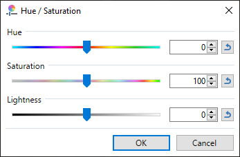

# Color correction ou color grading

Cette technique consiste à modifier l'apparence de l'image finale (modifier ses couleurs).

L'exemple fourni dans ```demo_postprocess.h``` démontre l'utilisation d'une matrice qui transforme les couleurs dans l'espace RGB. Cela permet d'obtenir des effets comme l'inversion, le filtre sepia, le noir et blanc et bien plus !

D'autres façons de faire existent, comme l'utilisation d'une lookup-table, ou LUT, pour mapper une couleur vers une autre. Cette technique a l'avantage de facilement être modifiable par un graphiste. Adrian Courreges analyse l'utilisation des LUT dans le jeu Metal Gear Solid V :  http://www.adriancourreges.com/blog/2017/12/15/mgs-v-graphics-study/.

On peut aussi fournir des outils au graphiste, comme par exemple une interface qui transforme les couleurs en utilisant les valeurs [HSL](https://en.wikipedia.org/wiki/HSL_and_HSV). La représentation des couleurs en HSL est plus intuitif pour effectuer certaines opérations de retouche d'image.



À vous d'imaginer une implémentation et utilisation pertinente qui pourrait être utile dans un jeu vidéo.