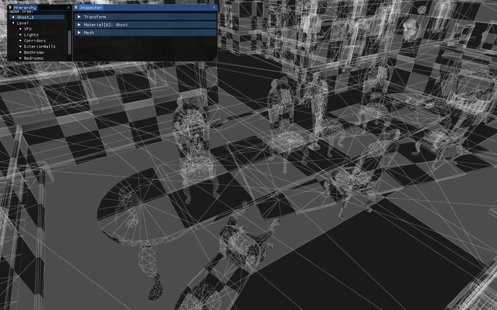

## TP FBX


**Le modèle de test ```level.fbx``` utilisé dans ces exemples est disponible sur le partage Drive.** Cette scène est extraite des assets Unity : [3D Beginner: Tutorial Resources](https://assetstore.unity.com/packages/essentials/tutorial-projects/3d-beginner-tutorial-resources-143848)

## I. Afficher un listing des données contenues dans la scène pour vous familiariser avec le format.

Le format FBX contient l'ensemble des données d'une scène. Ce qui nous intéresse pour ce TP sont les informations suivantes :
- La liste de mesh (FbxMesh)
- La liste de matériaux (FbxSurfaceMaterial)
- Un graphe de scène (FbxNode)

Chaque node contient de nombreuses informations, notamment :
 - Son placement dans l'espace (translation, rotation, scale)
 - Ses attributs (optionels) dont :
   - FbxMesh
   - FbxCamera
   - FbxLight

Voici un exemple de listing : 


On constate ici que la scène :
 - Contient 51 meshs
 - Contient 27 matériaux (tous de types FbxSurfacePhong, une spécialisation de FbxSurfaceMaterial)
 - Le scène graph contient 632 nodes

La node ```RootNode>Level>Bedrooms>Bedroom01>Bed``` contient un attribut de type mesh et a une texture diffuse qui pointe vers ```media/level.fbm/Bed_Albedo.tif```.

Préférez un affichage ImGui plutôt que textuel pur. Utilisez la fonction ImGui::TreeNode pour la hiérarchie du graph de scène.

### Fonctions utiles (liste non-exhaustive)
Pour charger le FBX :
 - FbxManager::Create
 - FbxIOSettings::Create
 - FbxImporter::Create
 - FbxImporter::Initialize
 - FbxImporter::Import
 - FbxScene::Create

Pour lister les éléments de la scène :
 - FbxScene::GetGeometryCount et FbxScene::GetGeometry
 - La classe FbxMesh hérite de la classe FbxGeometry
 - FbxScene::GetMaterialCount et FbxScene::GetMaterial
 - La classe FbxSurfacePhong hérite de la classe FbxSurfaceMaterial
 - FbxScene::GetNodeCount

Pour parcourir le scène graph :
 - FbxScene::GetRootNode
 - FbxNode::GetNodeAttributeCount
 - FbxNode::GetNodeAttributeByIndex
 - FbxNodeAttribute::GetFirstProperty et FbxNodeAttribute::GetNextProperty
 - Savoir que FbxLight, FbxMesh et FbxCamera héritent de FbxNodeAttribute

Voilà une interface possible pour parcourir et afficher toutes les propriétés d'une scène fbx.

```c++
// Internal functions
// ==================
// Inspect a property (switch case on FbxProperty::GetPropertyDataType().GetType())
// and its internal source objects
void InspectFBXProperty(FbxProperty* Property);
// Display list of properties of an object
void InspectFBXObject(FbxObject* Object);
// Show the node tree
void ShowFBXNodeTree(FbxNode* Node, FbxNode** NodeSelected);

// Interface functions
// ===================
// Show FbxScene tree
FbxNode* PG::ShowFBXSceneTree(FbxScene* FBXScene);
```

### Snippets utiles

Chaque FbxProperty peut contenir des FbxObjects ! (Exemple : La property diffuse peut contenir un SrcObject de type FbxFileTexture). Voir [Textures](https://help.autodesk.com/view/FBX/2015/ENU/?guid=__files_GUID_AD69D141_C5DD_4609_AD5A_4805321FADD4_htm).
```c++
FbxProperty* Property = ...;
for (int i = 0; i < Property->GetSrcObjectCount(); ++i)
{
    FbxObject* SrcObject = Property->GetSrcObject(i);
    // Inspect SrcObject properties
}
```

Caster un objet :
```c++
FbxFileTexture* FileTexture = FbxCast<FbxFileTexture>(SrcObject);
if (FileTexture)
    ImGui::LabelText("FileName", FileTexture->GetFileName());
```

### Liens utiles :
 - La doc : http://help.autodesk.com/view/FBX/2015/ENU/
 - Your First FBX SDK Program : http://help.autodesk.com/view/FBX/2015/ENU/?guid=__files_GUID_29C09995_47A9_4B49_9535_2F6BDC5C4107_htm

## II. Générer les données OpenGL pour afficher la géométrie de la scène (sans s'occuper des matériaux)

La classe FbxMesh nous propose plusieurs façon d'accéder aux données sous-jacentes (positions, uvs, normals). Voilà un lien vers sa documentation [FbxMesh](https://help.autodesk.com/view/FBX/2015/ENU/?guid=__cpp_ref_class_fbx_mesh_html).

Dans l'exemple suivant, par soucis de simplicité, on va stocker les meshs de façon non-indexée afin de pouvoir ensuite utiliser `glDrawArrays()`. On va aussi ajouter la contrainte de ne gérer que les meshs constitués de triangles, ce qu'on peut vérifier grâce à `FbxMesh::IsTriangleMesh()`.
```c++
// Pour l'instant, on se limite à gérer un seul type de format de vertex
struct fbx_vertex
{
    v3 Position;
    v3 Normal;
    v2 UV;
};
```
```c++
// Exemple de code pour accéder aux positions/uvs/normals
for (int PolygonIndex = 0; PolygonIndex < Mesh->GetPolygonCount(); ++PolygonIndex)
{
    for (int VertexIndex = 0; VertexIndex < 3; ++VertexIndex)
    {
        fbx_vertex Vertex = {};

        // Position
        FbxVector4 Position = Mesh->GetControlPointAt(Mesh->GetPolygonVertex(PolygonIndex, VertexIndex));
        Vertex.Position = { (float)Position[0], (float)Position[1], (float)Position[2] };

        // UV
        FbxVector2 UV0;
        FbxBool UV0Unmapped;
        // UVSetNames à récupérer avec FbxMesh::GetUVSetNames()
        if (Mesh->GetPolygonVertexUV(PolygonIndex, VertexIndex, UVSetNames[0], UV0, UV0Unmapped))
        {
            Vertex.UV = { (float)UV0[0], (float)UV0[1] };
        }
        
        // Normal
        FbxVector4 Normal;
        if (Mesh->GetPolygonVertexNormal(PolygonIndex, VertexIndex, Normal))
        {
            Vertex.Normal = { (float)Normal[0], (float)Normal[1], (float)Normal[2] };
        }

        Vertices.push_back(Vertex);
    }
}
```

### L'affichage du mesh
Plusieurs possibilités s'offrent à nous pour afficher le mesh. Dans les exemples suivant, on part du principe que tous les meshs sont dans un même VBO.

De plus, on va utiliser le [user pointer](https://help.autodesk.com/view/FBX/2015/ENU/?guid=__files_GUID_5FAF6FE0_5904_45C3_915A_DB0C9586D45B_htm) du FbxMesh pour stocker des informations que l'on pourra récupérer lors du parcours du scene graph.

Chaque mesh est donc représenté par cette structure :
```c++
struct fbx_mesh_gl_data
{
    GLuint Start;
    GLuint Count;
};
// Ce sont les paramètres à passer à la fonction glDrawArrays()
```
```c++
// Au chargement, on envoit les infos de la scene dans la VRAM
// Ici, seul les meshs sont envoyés en VRAM, mais on peut aussi y envoyer les textures
void UploadSceneToVRAM(FbxScene* FBXScene)
{
    std::vector<fbx_vertex> Vertices;
    for (int i = 0; i < Scene->GetGeometryCount(); ++i)
    {
        FbxMesh* Mesh = ...

        // ... Store mesh vertices into Vertices array

        // Store mesh vertices index info
        fbx_mesh_gl_data* MeshGLData = ...;
        MeshGLData->Start = ...; // Start index in Vertex array
        MeshGLData->Count = ...; // Vertex count for this mesh

        Mesh->SetUserDataPtr(MeshGLData);
    }

    // Gen unique VBO
    // Send Vertices to VBO
}
```

Fonction récursive pour la traversée et l'affichage du graph de scène (pseudo-code) :
```c++
void DisplayFbxNode(FbxNode* Node, const mat4& ViewProjectionMatrix, const mat4& ModelMatrix)
{
    FbxMesh* Mesh = Node->GetMesh();
    if (Mesh)
    {
        fbx_mesh_gl_data* MeshData = (fbx_mesh_gl_data*)Mesh->GetUserDataPtr();
        // Send matrix uniform
        // Draw vertices with glDrawArray(MeshData->Start, MeshData->Count)
    }
    
    for (int i = 0; i < Node->GetChildCount(); ++i)
    {
        FbxNode* Child = Node->GetChild(i);
        FbxMatrix Matrix = Child->EvaluateLocalTransform();
        mat4 ChildMatrix = ConvertFBXMatrixToMat4(Matrix);
        DisplayFBXNode(Child, ViewProjectionMatrix, ModelMatrix * ChildMatrix);
    }
}
```



### Liens utiles :
 - La classe VBOCache fournie dans les samples : https://help.autodesk.com/view/FBX/2017/ENU/?guid=__cpp_ref__view_scene_2_scene_cache_8h_example_html

## III. Ajouter les matériaux

Certains fbx contiennent des meshes avec plusieurs matériaux. Pour s'affranchir de cette contrainte, une solution est de convertir la scène au chargement :
```c++
FbxGeometryConverter Converter(FBXManager);
Converter.SplitMeshesPerMaterial(FBXScene, true);
```
De cette manière, la node contiendra plusieurs meshs qui auront chacun un unique matériel associé.

Extrait du parcours du scène graph :
```c++
    // Display meshes
    for (int i = 0; i < Node->GetNodeAttributeCount(); ++i)
    {
        FbxNodeAttribute* Attribute = Node->GetNodeAttributeByIndex(i);
        FbxMesh* Mesh = FbxCast<FbxMesh>(Attribute);
        
        if (Mesh)
        {
            int MaterialId = ...
            // On peut retrouver le material utilisé par le 1er polygone avec Mesh->GetElementMaterial()->GetIndexArray().GetAt(0)
            // Il vaut mieux stocker cette donnée
            BindFBXMaterial(Node->GetMaterial(MaterialId));
            DrawMesh(Mesh);
        }
    }

    // Recursively draw children
    ...
```

## IV. Ajouter les lights
