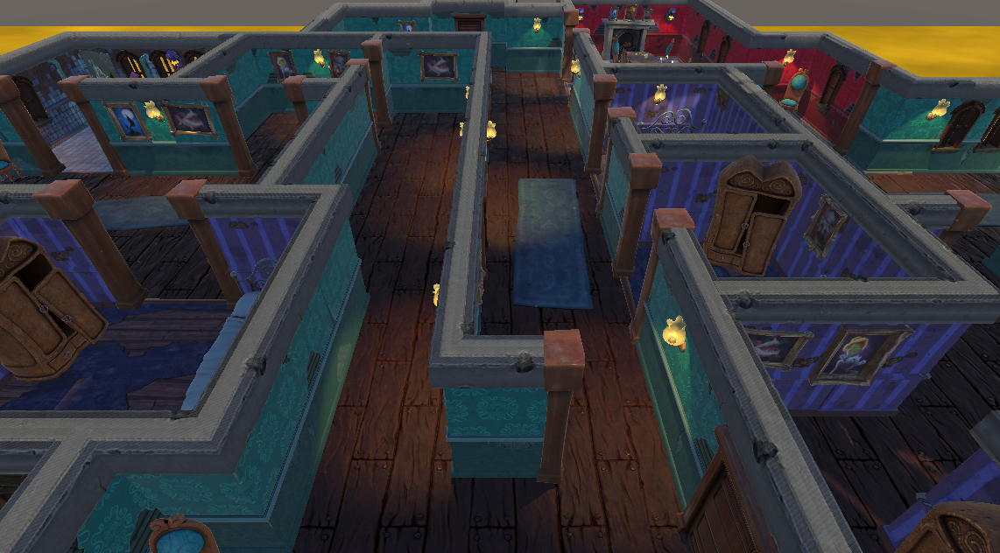
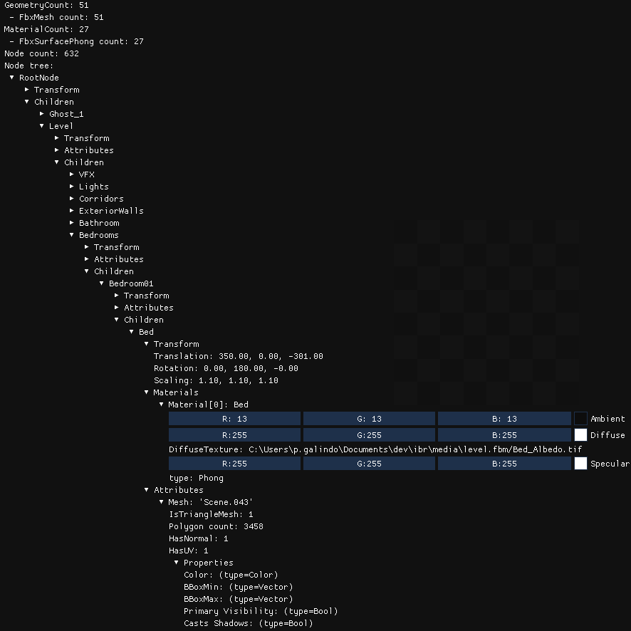

## TP FBX

<<<<<<< HEAD
# Installation du SDK fbx
=======

>>>>>>> Add fbx assignment

**Le modèle de test ```level.fbx``` utilisé dans ces exemples est disponible sur le partage Drive.** Cette scène est extraite des assets Unity : [3D Beginner: Tutorial Resources](https://assetstore.unity.com/packages/essentials/tutorial-projects/3d-beginner-tutorial-resources-143848)

## I. Afficher un listing des données contenues dans la scène pour vous familiariser avec le format.

Le format FBX contient l'ensemble des données d'une scène. Ce qui nous intéresse pour ce TP sont les informations suivantes :
- La liste de mesh (FbxMesh)
- La liste de matériaux (FbxSurfaceMaterial)
- Un graphe de scène (FbxNode)

Chaque node contient de nombreuses informations, notamment :
 - Son placement dans l'espace (translation, rotation, scale)
 - Ses attributs (optionels) dont :
   - FbxMesh
   - FbxCamera
   - FbxLight

Voici un exemple de listing : 



On constate ici que la scène :
 - Contient 51 meshs
 - Contient 27 matériaux (tous de types FbxSurfacePhong, une spécialisation de FbxSurfaceMaterial)
 - Le scène graph contient 632 nodes

La node ```RootNode>Level>Bedrooms>Bedroom01>Bed``` contient un attribut de type mesh et a une texture diffuse qui pointe vers ```media/level.fbm/Bed_Albedo.tif```.

Préférez un affichage ImGui plutôt que textuel pur. Utilisez la fonction ImGui::TreeNode pour la hiérarchie du graph de scène.

### Fonctions utiles (liste non-exhaustive)
Pour charger le FBX :
 - FbxManager::Create
 - FbxIOSettings::Create
 - FbxImporter::Create
 - FbxImporter::Initialize
 - FbxImporter::Import
 - FbxScene::Create

Pour lister les éléments de la scène :
 - FbxScene::GetGeometryCount et FbxScene::GetGeometry
 - La classe FbxMesh hérite de la classe FbxGeometry
 - FbxScene::GetMaterialCount et FbxScene::GetMaterial
 - La classe FbxSurfacePhong hérite de la classe FbxSurfaceMaterial
 - FbxScene::GetNodeCount

Pour parcourir le scène graph :
 - FbxScene::GetRootNode
 - FbxNode::GetNodeAttributeCount
 - FbxNode::GetNodeAttributeByIndex
 - FbxNodeAttribute::GetFirstProperty et FbxNodeAttribute::GetNextProperty
 - Savoir que FbxLight, FbxMesh et FbxCamera héritent de FbxNodeAttribute

### Liens utiles :
 - La doc : http://help.autodesk.com/view/FBX/2015/ENU/
 - Your First FBX SDK Program : http://help.autodesk.com/view/FBX/2015/ENU/?guid=__files_GUID_29C09995_47A9_4B49_9535_2F6BDC5C4107_htm

## II. Générer les données OpenGL pour afficher la géométrie de la scène (sans s'occuper des matériaux)

A suivre...

### Liens utiles :
 - La classe VBOCache fournit dans les samples : https://help.autodesk.com/view/FBX/2017/ENU/?guid=__cpp_ref__view_scene_2_scene_cache_8h_example_html

## III. Ajouter les matériaux

## IV. Ajouter les lights
