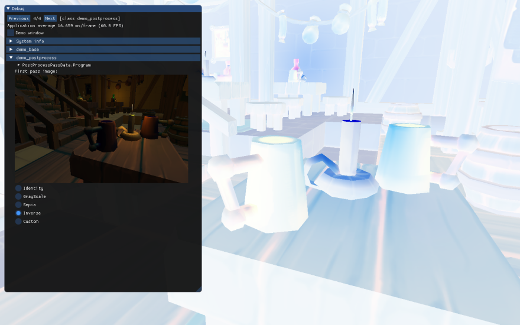

# Demo post-process

[src/demo_postprocess.h](../src/demo_postprocess.h)

Exemple de setup de FBO afin de pouvoir faire un effet de post-process sur l'ensemble des pixels.



La création d'un framebuffer nouse permet de rendre notre scène offscreen. 

On peut ensuite récupérer la texture générée et l'afficher sur un quad plein écran. L'implémentation du fragment shader nous donne alors l'opportunité de faire un traitement spécifique sur chaque pixel de l'image.

Voilà notre boucle de rendu (en code abrégé).

``` c++
void demo_postprocess::Update(const platform_io& IO)
{
    ...

    // ============================
    // 1ère passe : Rendu offscreen
    // ============================

    // Binding de notre framebuffer
    glBindFramebuffer(GL_FRAMEBUFFER, Framebuffer.FBO);

    // On clear le color buffer et le depth buffer attachés à ce framebuffer
    glClear(GL_COLOR_BUFFER_BIT | GL_DEPTH_BUFFER_BIT);

    // On effectue le rendu d'une scène, les pixels vont alors être écrits 
    // dans les buffers (de couleurs et de profondeurs) attachés à notre
    // framebuffer.
    DemoBase.Render(ProjectionTransform, ViewTransform, Mat4::Identity());

    // ============================
    // 2ème passe : Rendu d'un quad fullscreen avec la texture obtenue lors de
    // la 1ère passe
    // ===========================

    // Re-bind du framebuffer par défaut, c'est lui qui va être affiché dans la
    // fenêtre, lors du swap buffer.
    glBindFramebuffer(GL_FRAMEBUFFER, 0);
    
    glClear(GL_COLOR_BUFFER_BIT | GL_DEPTH_BUFFER_BIT);

    // Rendu d'un quad fullscreen
    glUseProgram(TexturedQuadProgram);
    // Framebuffer.ColorTexture est l'id de la texture qui contient les pixels
    // de la 1ère passe
    glBindTexture(GL_TEXTURE_2D, Framebuffer.ColorTexture);
    glBindVertexArray(TexturedQuadVAO);
    glDrawArrays(GL_TRIANGLES, 0, 6);

    ...
}
```

La mise en place d'un framebuffer nécessite la création d'un FBO (Framebuffer object) grâce à ```glGenFramebuffers```.

Un FBO est une sorte de contenant de buffers de pixels. Par exemple, dans ```demo_postprocess.h``` nous créons un framebuffer qui contient 2 buffers :
- Un color buffer (dans lequel le fragment shader va écrire la couleur)
- Un depth buffer (qui va contenir la profondeur du pixel)


Mais d'autres compositions sont possibles !

Voilà un exemple pour un deferred renderer :

- Color buffer 0 RGBA (diffuse.r + diffuse.g + diffuse.b + metallic)
- Color buffer 1 RGBA (normal.x + normal.y + normal.z + roughness)
- Color buffer 2 RGBA (emissive.r + emissive.b + emissive.b + occlusion)
- Depth/stencil buffer

Ces buffers peuvent prendre 2 formes : 
- Renderbuffer
- Texture

La différence est que la texture va pouvoir être réutilisé par la suite par un autre shader.

## Liste des fonctions liées au FBO :
- glGenFramebuffers
- glBindFramebuffer
- glFramebufferTexture2D : Attache d'une texture
- glFramebufferRenderbuffer : Attache d'un render buffer
- glCheckFramebufferStatus : Vérification que le framebuffer est valide
- glDrawBuffers : Nécessaire lorsque l'on veut écrire dans 2 color buffers ou plus

## Liens :
- [Framebuffer](https://www.khronos.org/opengl/wiki/Framebuffer)
