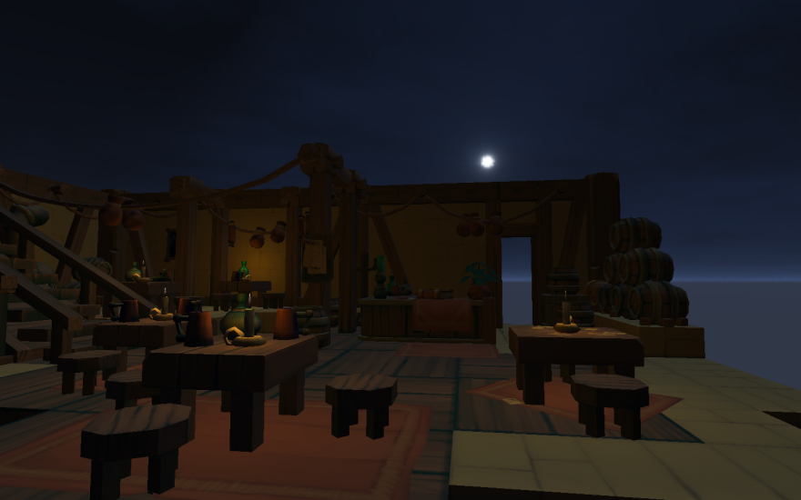

# Skybox

[src/demo_pg_skybox.h](../src/demo_pg_skybox.h)

L'effet recherché est de donner l'impression d'être au milieu d'un espace immense.



L'illusion est possible car dans la réalité, les objets lointains se déplacent relativement plus lentement dans notre champs de vision.

Il existe plusieurs façon d'arriver au même résultat. Nous voyons ici une des techniques possible.

## Mise en oeuvre

- Générer un cube dont les 6 faces affichent les textures de la skybox.
- Si le backface culling est actif, s'assurer que leurs faces apparentes soient bien dirigées vers l'intérieur. Voir [Face Culling](https://www.khronos.org/opengl/wiki/Face_Culling).
- Désactiver l'écriture dans le depth buffer. Voir [```glDepthMask()```](http://docs.gl/gl3/glDepthMask).
- Rendre le cube
    - Il doit être centré sur la position de la caméra (pour englober le joueur)
    - Tout ombrage doit être désactivé (flat shading)
- Réactiver l'écriture dans le depth buffer.
- Rendre la scène.

Le désavantage de cette technique est que l'on rend la skybox avant la scène. Cela entraine de l'overdraw (les pixels sont écrits plusieurs fois), ce qui entraine un fillrate plus élevé.